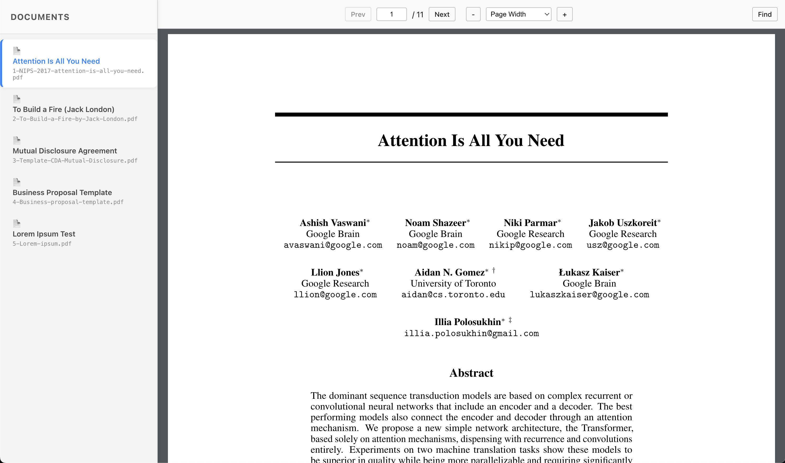

# custom-react-pdf-viewer

[](https://www.npmjs.com/package/custom-react-pdf-viewer)
[](https://opensource.org/licenses/Apache-2.0)

A lightweight React component that wraps Mozilla's `pdf.js` to provide a "drop-in" PDF viewer with a fully-featured toolbar and find bar.



## About This Project

This repository is a monorepo containing two main parts:

* **`packages/custom-react-pdf-viewer`**: The published npm package. This is the component you install in your app.
* **`apps/demo`**: A Vite + React demo app for local development and testing.

### 📦 The Package: `custom-react-pdf-viewer`

The goal of this package is to provide a simple, "batteries-included" React component for viewing PDF documents. It bundles `pdf.js` with a clean, modern UI for navigation, zoom, and text search, saving you from writing complex boilerplate.

**Key Features:**
* **Full Toolbar:** Page navigation, page number input, and zoom controls.
* **Find Bar:** `Ctrl+F` support, "Highlight All," "Match Case," and other standard find controls.
* **Simple API:** Just pass a `File` or `Blob` object to the component.
* **Custom Styling:** Use CSS custom properties to override default styles.
* **TypeScript:** Written in TypeScript with types included.

---

## 📖 Documentation & Usage

For full installation instructions, component props, and styling guides, please see the package's dedicated README:

## [➡️ Read the `custom-react-pdf-viewer` README](./packages/custom-react-pdf-viewer/README.md)

---

## 🚀 Local Development (Contributing)

This section is for developers who want to run the demo app locally or contribute to the package. This project uses **pnpm** as a package manager.

**1. Install dependencies:**
```bash
pnpm install
```

**2. Run the demo app:**

This will start the demo app on `http://localhost:5173`.

```bash
pnpm demo
```

**3. Build the library:**

To run a production build of the custom-react-pdf-viewer package:

```bash
pnpm build:lib
```

**Usage**

You must import the component.

```typescript
// src/App.tsx
import { useEffect, useState } from "react";
import { CustomPdfViewer } from "custom-react-pdf-viewer";

export default function App() {
  // We just need to store the blob itself, or null
  const [file, setFile] = useState<Blob | null>(null);

  useEffect(() => {
    (async () => {
      // Fetch and get the blob
      const res = await fetch("/sample.pdf");
      const blob = await res.blob();
      setFile(blob);
    })();
  }, []);

  if (!file) return <div style={{ padding: 24 }}>Loading…</div>;

  return (
    <div style={{ height: "100vh", width: "100vw" }}>
      <CustomPdfViewer
        fileName="sample.pdf"
        file={file}
      />
    </div>
  );
}
```

## Component Props

| Prop | Type | Description |
| :--- | :--- | :--- |
| **`file`** | `Blob \| null` | **Required.** The `File` or `Blob` object of the PDF. The component will handle creating and revoking the blob URL. |
| `fileName` | `string` | Optional. The name to display in the toolbar. |
| `isLoading` | `boolean` | Optional. Set to `true` to display the loading bar. Set to `false` when the `blobUrl` is ready. |

## Styling

You can override the default colors and styles by setting these CSS custom properties in your own stylesheet:

```css
/* Example styling overrides */
:root {
  /* Toolbar */
  --custom-pdf-toolbar-bg: #f9f9fa;
  --custom-pdf-toolbar-border-color: #b8b8b8;
  --custom-pdf-main-color: #181819;

  /* Find Bar */
  --custom-pdf-findbar-bg: #f9f9fa;
  --custom-pdf-findbar-border-color: #b8b8b8;

  /* Buttons */
  --custom-pdf-button-hover-color: #ddd;
  --custom-pdf-toggled-btn-bg: #00000033;
  --custom-pdf-toggled-btn-color: #000;

  /* Form Fields */
  --custom-pdf-field-border-color: #bbb;
  --custom-pdf-field-bg-color: white;
  --custom-pdf-field-color: #060606;

  /* Viewer */
  --custom-pdf-container-bg: #f2f2f2;
  --custom-pdf-viewer-bg: #f1f5f9;
}
```

## 📜 License

This project is licensed under the Apache License, Version 2.0.

---